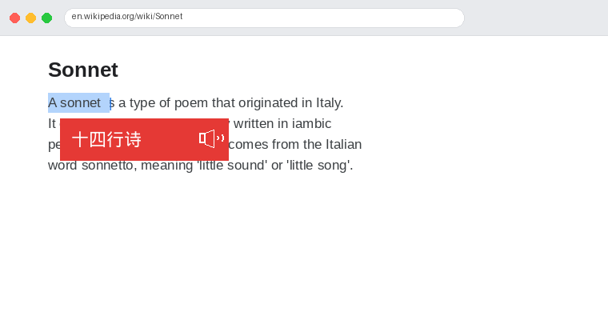

# trans-popup

**划选英文，立刻翻译。** 在 Linux 桌面任意位置（浏览器、终端、PDF、文档）双击或划选英文单词/句子，即刻弹出中文翻译，并支持真人发音。



---

## ✨ 功能特点

- **全局生效** — 浏览器、终端、文档、任何 X11 应用均可触发
- **双击选词** — 双击单词，松手即显示翻译
- **划选句子** — 拖动选中整句，同样翻译
- **真人发音** — 点击 🔊 按钮，谷歌慢速发音，适合学习
- **极速响应** — 直接调用 Google Translate API，单词约 200ms
- **智能缓存** — 查过的词瞬间显示，零延迟
- **无遮挡** — 弹窗出现在选区下方，不遮挡原文
- **无阴影** — 干净的红色弹窗，无窗口阴影装饰
- **自动消失** — 5 秒后自动关闭，点击任意处关闭

---

## 📋 系统要求

- Linux（X11 会话，非 Wayland）
- Python 3.8+
- GNOME / KDE / XFCE 等桌面环境

---

## 🚀 安装

### 一键安装

```bash
git clone https://github.com/w22893192-sys/trans-popup.git
cd trans-popup
chmod +x install.sh
./install.sh
```

### 手动安装

**1. 安装系统依赖**

```bash
sudo apt install python3-gi python3-xlib xclip ffmpeg
```

**2. 安装 Python 依赖**

```bash
pip3 install gtts
```

**3. 运行**

```bash
python3 trans-popup.py &
```

---

## ⚙️ 开机自动启动

```bash
mkdir -p ~/.config/autostart
cp trans-popup.desktop ~/.config/autostart/
```

或手动在系统「开机启动」设置中添加：

```
/usr/bin/python3 /path/to/trans-popup.py
```

---

## 🖱️ 使用方法

| 操作 | 效果 |
|------|------|
| 双击英文单词 | 弹出中文翻译 |
| 拖动选中英文句子 | 弹出中文翻译 |
| 点击 🔊 | 播放英文发音（慢速） |
| 点击弹窗任意处 | 关闭弹窗 |
| 等待 5 秒 | 弹窗自动消失 |

---

## 🔧 自定义

打开 `trans-popup.py`，顶部几个参数可以调整：

| 变量 | 默认值 | 说明 |
|------|--------|------|
| CSS `background-color` | `#e53935` | 弹窗背景颜色 |
| CSS `font-size` | `17px` | 翻译文字大小 |
| `GLib.timeout_add(5000` | 5000ms | 弹窗显示时长 |

---

## 📦 依赖说明

| 依赖 | 用途 |
|------|------|
| `python3-gi` | GTK3 弹窗渲染 |
| `python3-xlib` | 检测鼠标按键状态（防止选词不完整） |
| `xclip` | 读取选区文本 |
| `ffmpeg` | 播放 Google TTS 音频 |
| `gtts` | 生成英文发音（Google TTS） |

翻译使用 Google Translate 免费接口，无需 API Key，需要联网。

---

## 🐛 常见问题

**Q: 弹窗不出现？**
- 确认在 X11 会话下运行（不支持纯 Wayland）
- 检查 `xclip` 是否已安装：`which xclip`
- 查看日志：`cat /tmp/trans-popup.log`

**Q: 发音没声音？**
- 确认 `ffmpeg` 已安装：`which ffplay`
- 检查系统音量

**Q: 翻译显示"—"？**
- 检查网络连接

---

## 📄 License

MIT License
